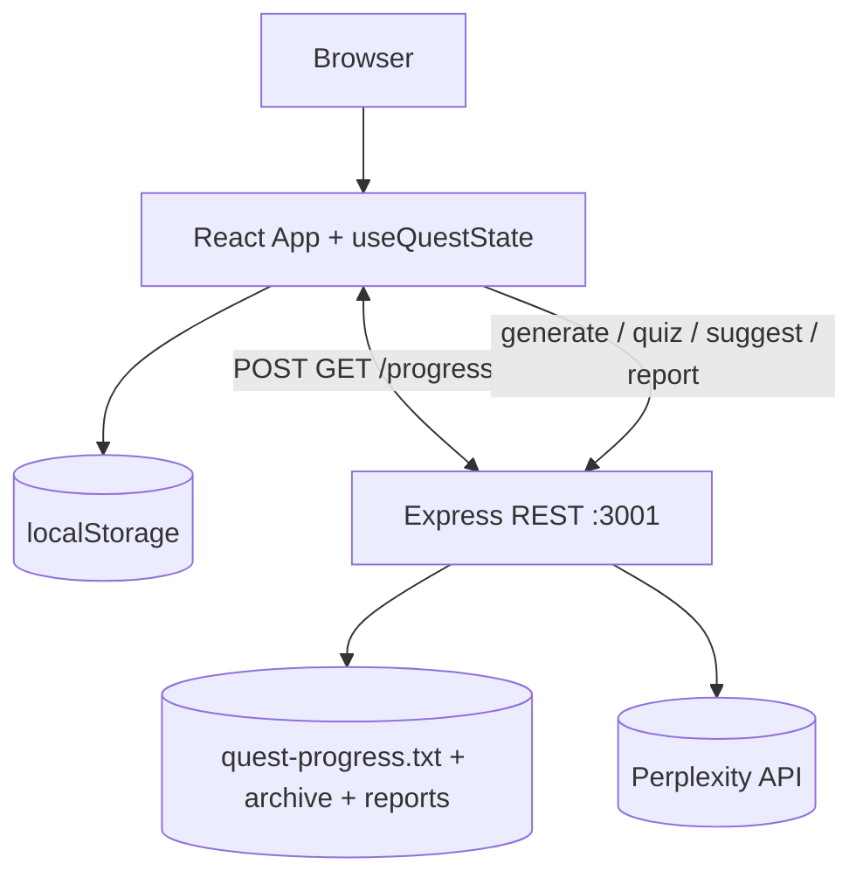
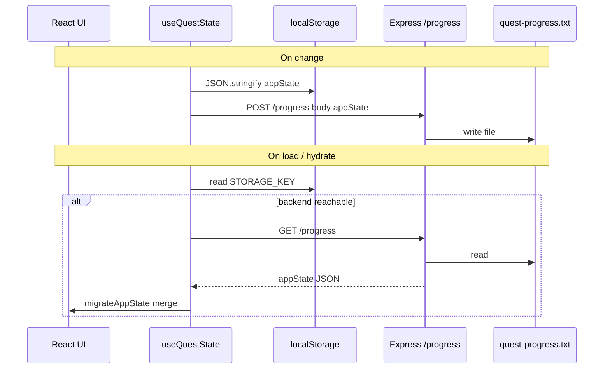
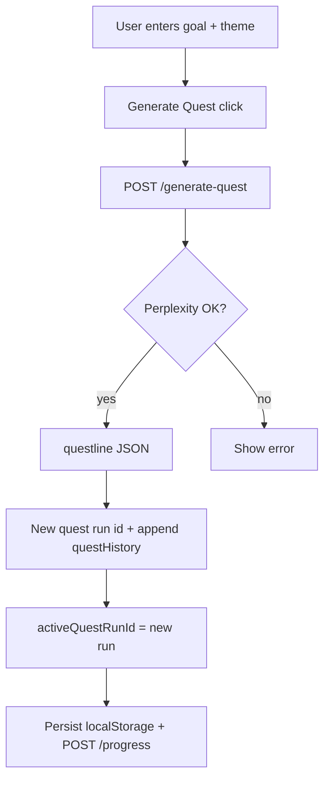
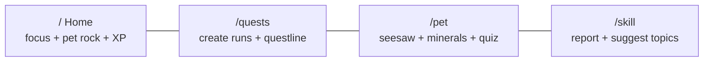
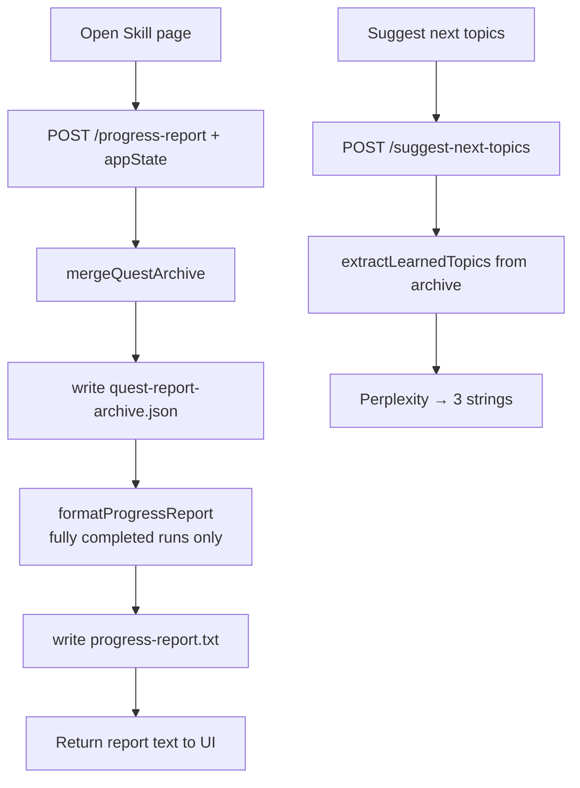
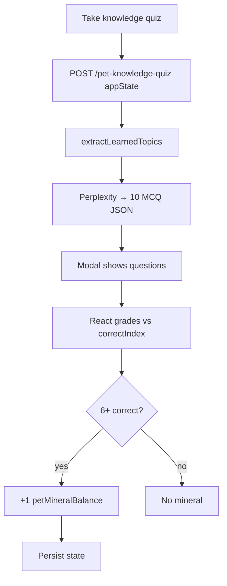
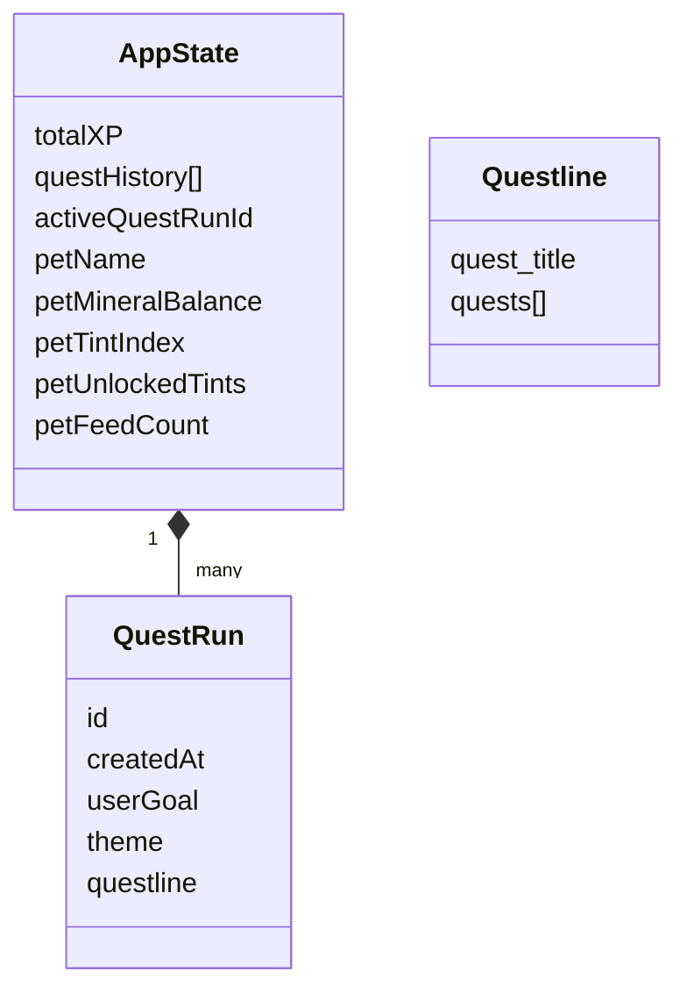

# Questify — system diagrams & flow charts

Use this file in [Mermaid Live Editor](https://mermaid.live) (paste a diagram, then **Actions → PNG/SVG**) or open **`docs/diagrams-viewer.html`** in your browser and use **Print → Save as PDF**.

---

## 1. High-level system architecture

---

## 2. Data persistence flow

---

## 3. Quest generation flow

---

## 4. App routes (user navigation)

---

## 5. Skill page & archive flow

---

## 6. Pet knowledge quiz & minerals

---

## 7. State model (simplified)

---

## How to download as image or PDF

| Method | Steps |
|--------|--------|
| **Mermaid Live** | Copy any `mermaid` block above → [mermaid.live](https://mermaid.live) → paste → **Actions** → Export **PNG** or **SVG**. |
| **Local HTML** | Open `docs/diagrams-viewer.html` in Chrome/Firefox → **Print** → **Save as PDF**, or screenshot. |
| **VS Code** | Install a Mermaid preview extension and export from the preview. |

---

*HackHayward 2026 — Questify*
